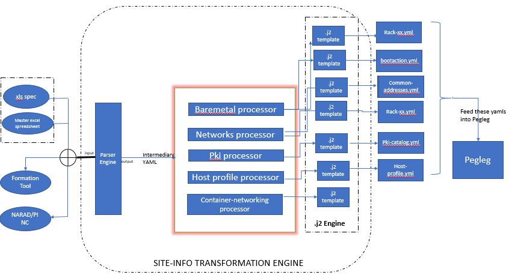
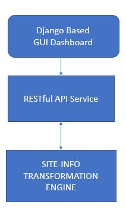

..
 This work is licensed under a Creative Commons Attribution 3.0 Unported
 License.

 http://creativecommons.org/licenses/by/3.0/legalcode

==========================================
Tugboat
==========================================

This blueprint introduces a new tool to transform site-specific information onto Pegleg manageable manifests for Airship.

Problem description
===================

During the deployment of Airship Genesis node via Pegleg, it expects that 
the deployment engineer provides all the information pertained to Genesis, 
Controller & Compute nodes such as PXE IPs, VLANs pertained to Storage 
network, Kubernetes network, Storage disks, Host profiles etc. as 
manifests/yamls that are easily understandable by Pegleg. 
Currently, these inputs are populated manually by deployment engineers based 
on various unstructured sources provided to them. Considering, there would be 
multiple sites for which we need to generate such data, it makes the process 
cumbersome, error-prone and time-intensive.
The workaround to this problem would be to automate and standardize the site 
information through a single and structured source and provide a GUI/API to 
view and modify the site details without worrying about Pegleg structure and 
conventions.

Proposed change
===============

Proposal here is to provide an Automation utility to pull the relevant information 
about a specific site from standardized sources such as Formation tool, NARAD/PINC, 
standardized excel spreadsheet specification. The automation framework would be 
responsible to pull the site information from NARAD/PINC (or fallback to XLS Spec 
whenever unavailable on NARAD/PINC) and automatically populate the site-specific 
manifests that are necessary to be consumed by Pegleg.

**Implement the Automation Engine to obtain site information from either excel spreadsheet, Formation tool or NARAD/PINC**

   -    The Parser engine (in Fig above) parses the necessary information 
           -	Formation tool using APIs
           - 	NARAD/PINC via APIs
           - 	Excel spreadsheet via Python parsers
   -	The Parser engine outputs an intermediary yaml (as per internal format 
        specification) and used within the automation engine context only.
   -	Develop and build internal processors such as bare metal, networks, pki,
        host profile etc. for handling information pertained to those specific manifests.

**Implement a RESTful API service**
   -	This RESTful API service would primarily be responsible for allowing the user 
        to view and modify some of the site information before updating the Pegleg manifests.
   -	This service would provide additional flexibility for deployment engineers to 
        modify/view some of the elements before deployment.
		
**Implement a GUI Dashboard client**
   -	Provide a simple Django-based dashboard client to display all the attributes/elements relevant to the site manifests
   -	The dashboard would also provide few fields as editable for the user to perform modifications before deployment.
   -	The dashboard would not be providing any authentication/authorization mechanisms
   -	The dashboard client would consume the RESTful interface exposed by the API Service as shown in fig 1.1 below.
   

    
*  This blueprint covers the following
   -	Implement an Automation Engine to obtain site information from only excel spreadsheet.
   -	Provide a RESTful API service to view and modify (ONLY certain attributes) relevant site information data.
   -	Provide a Django based GUI dashboard to support view & modify (ONLY certain attributes) relevant site information data.

Alternatives
------------

No existing utilities available to transform site information automatically, but this implementation would be 
similar to Spyglass.

REST API impact
---------------

TODO

Security impact
---------------

None

Other end user impact
---------------------

Site yaml configuration updates as specified in Proposed change

Performance Impact
------------------

None

Other deployer impact
---------------------

TODO

Developer impact
----------------

None

Implementation
==============

Assignee(s)
-----------

Primary assignee:
  PradeepKumar KS

Other contributors:
  Hemanth Nakkina
  Gurpreet Singh

Dependencies
============

TODO

Testing
=======

TODO

Documentation Impact
====================

Create a documentation providing a detailed user-guide and APIs 
exposed as part of this tool.

References
==========

None
